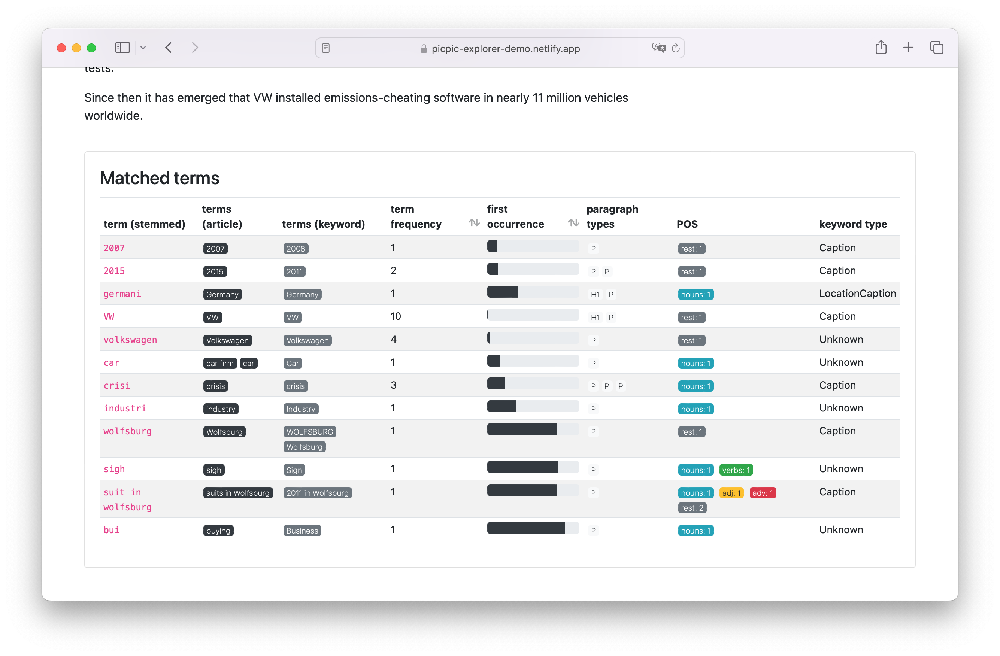
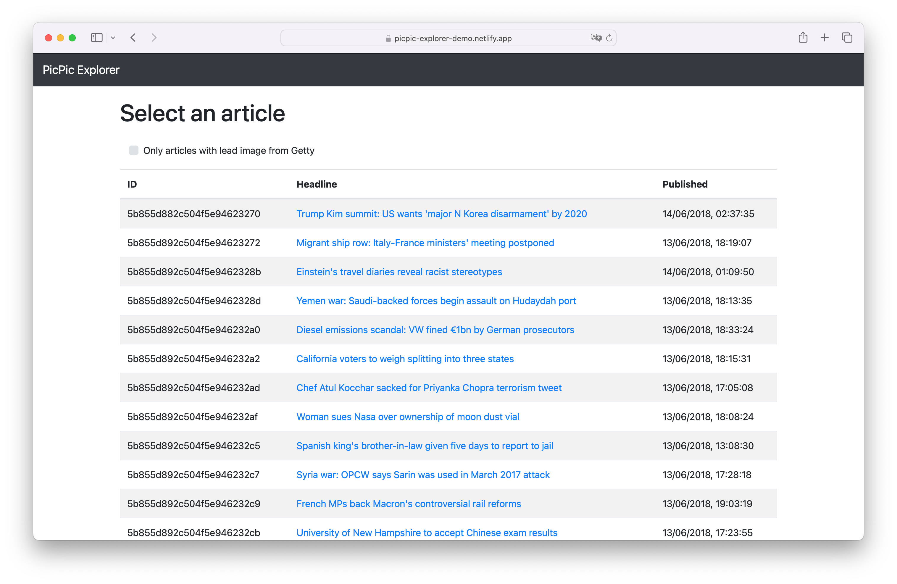
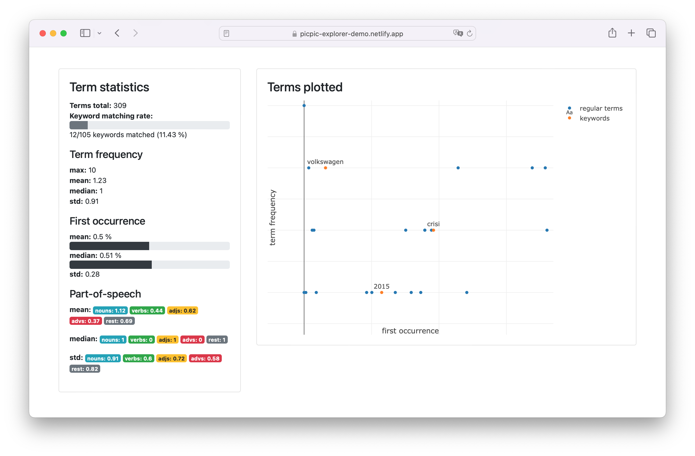

# PicPic Explorer

A little Vue app I used for data analysis in my bachelor's thesis. 

[PicPic](https://github.com/mgschoen?tab=repositories&q=picpic&type=&language=&sort=) is a set of applications that automatically select images for news articles. It uses multiple approaches such as pre-trained neural networks and static keyword extraction to create a search query that can be used in image databases.

I trained the neural networks from scratch on a [corpus of 20,000 scraped articles from the BBC](https://github.com/mgschoen/gettygetter). While analysing and refining the training and extraction approaches, I used this explorer application to make sense of the huge dataset.

PicPic Explorer originally consumed data from a [self-written NodeJS backend](https://github.com/mgschoen/picpic-api) that served content from MongoDB and used Bing Image Search for displaying image suggestions. Most of this is not working anymore, but you can get a sense of how it worked in this static demo: https://picpic-explorer-demo.netlify.app/



## Usage

Uses NodeJS 10.

``` bash
# install dependencies
yarn install

# serve with hot reload at localhost:8080
yarn run dev
yarn run dev-demo # alternative, runs the demo application

# build for production with minification
yarn run build
yarn run build-demo # alternative, builds the demo application
```

## More screenshots!


